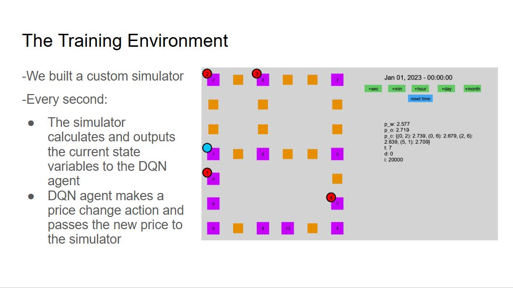

# Gasoline Pricing Optimization Using Deep Reinforcement Learning
Reinforcement Learning
Final project for CSCE 642 (Deep Reinforcement Learning)

Group Members: Collin Rogers (128007214) and Mahima Ganni (236002627)

[](https://youtu.be/1ALGR3lCFHY)

## Get Started
### Clone the repository 
```
git clone https://github.com/crogers2001/gaspricer.git
cd gaspricer
```

### Setup the environment 
For setting up the environment, we recommend using conda + pip or virtual env + pip. The Python environment required is 3.9.16 (version)

Install the packages given by
```bash
pip install -r requirements.txt
```

## Running the simulator
To run the simulator

```bash
python main.py
```
